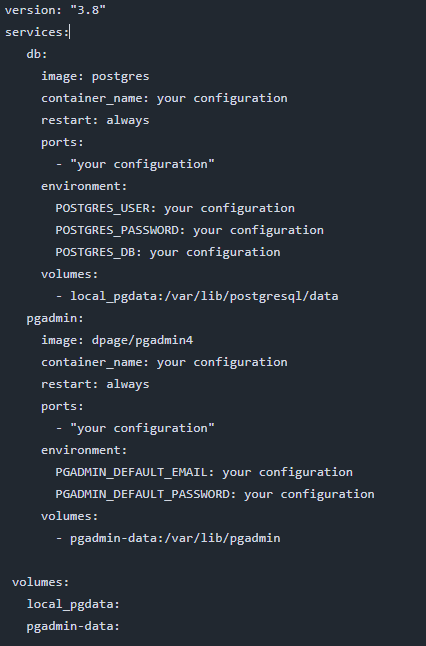
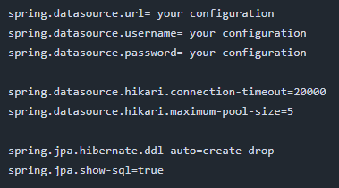

### Songify
## PURPOSE OF THE APPLICATION

The purpose of the application is to manage your music library.

## Technologies

The application is based on a backend layer written in Java (version 17) using frameworks such as Spring Boot (version 3.3.5) and Hibernate. 
The application uses a relational database managed by the PostgreSQL system. The application uses a Docker environment.

### Configuration
After cloning the application, we run it in any idea like IntelliJ IDEA Ultimate. We need to run Docker and database: PostgreSQL. If you want you can
can use another relational database. Each database you need to configure.

Example Docker configuration:
1. You need to create docker-compose.yml file.
2. Next, you should insert sample code:

  
   
3. Run docker-compose.yml
4. Next you need to create your database in PostgreSQL.
5. And next you should configure database in IntelliJ IDEA Ultimate.
6. Example configuration of application.properties file:

7. We run the application using the SongifyApplication class.

### Running
To test the application, you can use Swagger, which is already configured in the application, or you can use Postman, for example.

For each object you can perform different functions. For example: 
* You can add and update songs.
* You can get all songs or selected song.
* You can delete a song.
* You can add genre.
* You can get all genres or selected genre.
* You can delete genre.
* You can add artist.
* You can add artist with default album and default song..
* You can update artists.
* You can get all artists or selectd artist.
* You can add an album with an existing song.
* You can get all albums or selectd album.
* You can get album with songs.
* You can get album with songs and artists.

* The application is still under development with new functionalities.

  
